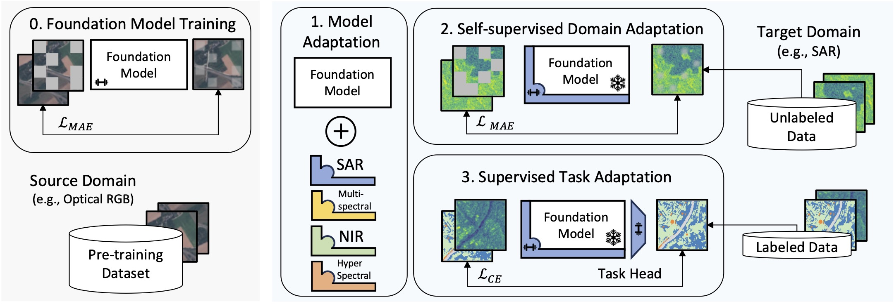

# Parameter Efficient Self-Supervised Geospatial Domain Adaptation
**[Paper](https://openaccess.thecvf.com/content/CVPR2024/papers/Scheibenreif_Parameter_Efficient_Self-Supervised_Geospatial_Domain_Adaptation_CVPR_2024_paper.pdf)** | **[Poster]()** | **[Slides]()** | **[Video](https://www.youtube.com/watch?v=SwmF-m5IBEw&t=8s)**

This repository contains code supporting the CVPR 2024 paper [Parameter Efficient Self-supervised Geospatial Domain Adaptation](https://openaccess.thecvf.com/content/CVPR2024/html/Scheibenreif_Parameter_Efficient_Self-Supervised_Geospatial_Domain_Adaptation_CVPR_2024_paper.html).

Authors: [Linus Scheibenreif](https://scheibenreif.github.io)    [Michael Mommert](https://mommermi.github.io) [Damian Borth](https://ics.unisg.ch/chairs/damian-borth-artificial-intelligence-and-machine-learning/)



# Background
As large-scale foundation models become publicly available for different domains efficiently adapting them to individual downstream applications and additional data modalities has turned into a central challenge. For example foundation models for geospatial and satellite remote sensing applications are commonly trained on large optical RGB or multi-spectral datasets although data from a wide variety of heterogeneous sensors are available in the remote sensing domain. This leads to significant discrepancies between pre-training and downstream target data distributions for many important applications. Fine-tuning large foundation models to bridge that gap incurs high computational cost and can be infeasible when target datasets are small. In this paper we address the question of how large pre-trained foundational transformer models can be efficiently adapted to downstream remote sensing tasks involving different data modalities or limited dataset size. We present a self-supervised adaptation method that boosts downstream linear evaluation accuracy of different foundation models by 4-6% (absolute) across 8 remote sensing datasets while outperforming full fine-tuning when training only 1-2% of the model parameters. Our method significantly improves label efficiency and increases few-shot accuracy by 6-10% on different datasets.

# Getting Started
This codebase provides scripts to add SLR adapters to existing, trained, visual foundation models before fine-tuning them on different downstream tasks. To get started, make sure that the trained weights for a visual foundation model are available in the ´checkpoints/´ directory and download a dataset for training.
See below for the models and datasets used in the paper: 

## Foundation Models
### MAE
* [Project](https://github.com/facebookresearch/mae)
* [ViT-L Encoder](https://dl.fbaipublicfiles.com/mae/pretrain/mae_pretrain_vit_large.pth)
* [ViT-L Encoder-Decoder](https://dl.fbaipublicfiles.com/mae/visualize/mae_visualize_vit_large.pth)
### SatMAE
* [Project](https://github.com/sustainlab-group/SatMAE)
* [FMoW Model](https://zenodo.org/record/7369797/files/fmow_pretrain.pth)
* [FMoW Temporal Model](https://zenodo.org/record/7369797/files/pretrain_fmow_temporal.pth)

### Scale-MAE
* [Project](https://github.com/bair-climate-initiative/scale-mae)

## Datasets
Where possible, use [torchgeo](https://github.com/microsoft/torchgeo) implementations of remote sensing datasets. Please download the other dataset from these locations:
* [TreeSatAI](https://zenodo.org/records/6598391)
* [EuroSAT-SAR](https://huggingface.co/datasets/wangyi111/EuroSAT-SAR)
* [BENGE-8k](https://github.com/HSG-AIML/ben-ge)


# Dependencies
* `torchgeo==0.5.0`
* `timm==0.6.12`
* `torch==2.0.1`


# Acknowledgements
If you would like to reference our work, please use the following reference:
```
@InProceedings{Scheibenreif_2024_CVPR,
    author    = {Scheibenreif, Linus and Mommert, Michael and Borth, Damian},
    title     = {Parameter Efficient Self-Supervised Geospatial Domain Adaptation},
    booktitle = {Proceedings of the IEEE/CVF Conference on Computer Vision and Pattern Recognition (CVPR)},
    month     = {June},
    year      = {2024},
    pages     = {27841-27851}
}
```