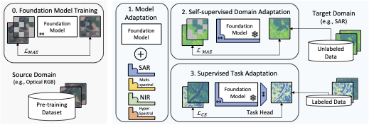

# Parameter Efficient Self-Supervised Geospatial Domain Adaptation

This repository contains code supporting the CVPR 2024 paper "Parameter Efficient Self-supervised Geospatial Domain Adaptation".

[Open Access Link](https://openaccess.thecvf.com/content/CVPR2024/html/Scheibenreif_Parameter_Efficient_Self-Supervised_Geospatial_Domain_Adaptation_CVPR_2024_paper.html)

## Versions
This assumes:
* `torchgeo==0.5.0`
* `timm==0.6.12`
* `torch==2.0.1`

## Notes
### ETCI2021
* I removed the water mask, only predict the flood mask
* The two masks sometimes overlap -> should be a multi-label problem

# Acknowledgements
If you would like to reference our work, please use the following reference:
´´´
@InProceedings{Scheibenreif_2024_CVPR,
    author    = {Scheibenreif, Linus and Mommert, Michael and Borth, Damian},
    title     = {Parameter Efficient Self-Supervised Geospatial Domain Adaptation},
    booktitle = {Proceedings of the IEEE/CVF Conference on Computer Vision and Pattern Recognition (CVPR)},
    month     = {June},
    year      = {2024},
    pages     = {27841-27851}
}
´´´